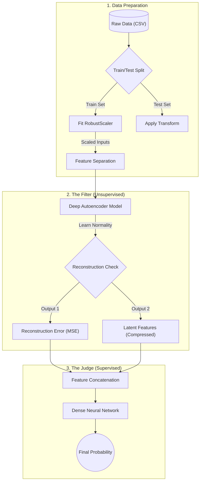
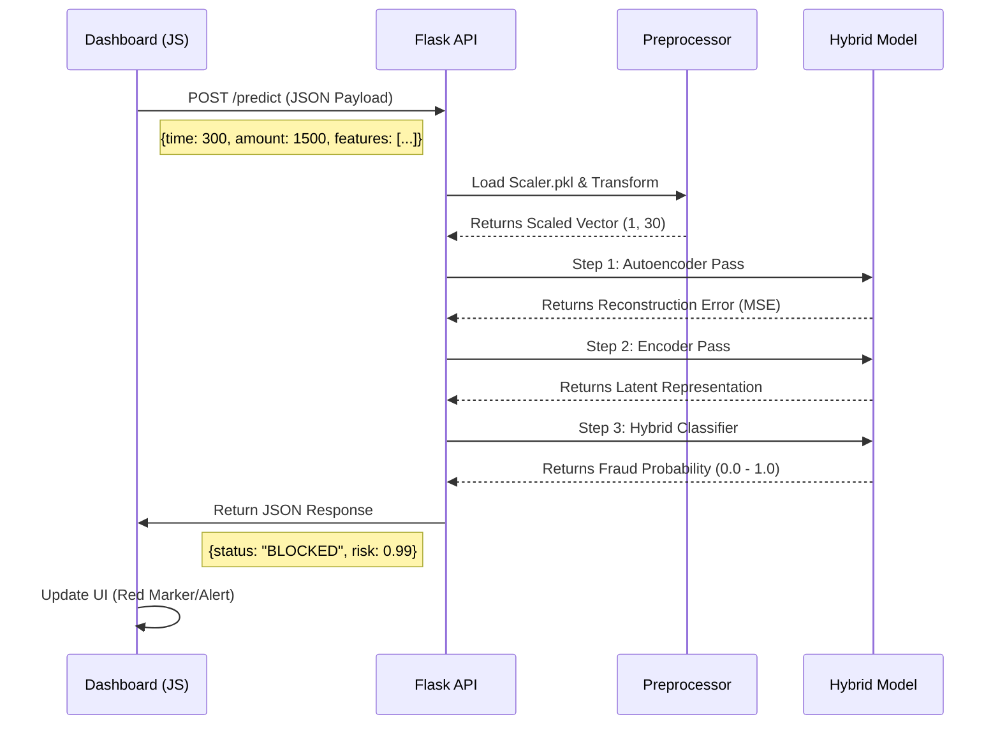

# FraudGuard AI: Real-Time Threat Intelligence with Hybrid Fraud Detection System


<p align="center">
  
  
  
  
  
</p>

<p align="center">
  
  
  
  
</p>

</div>

---

##  Executive Summary

**FraudGuard AI**  is a sophisticated financial security system designed to detect fraudulent credit card transactions in real-time. To overcome the limitations of traditional models that struggle with highly imbalanced datasets, this system employs a Hybrid AI Architecture that fuses Unsupervised Learning (Autoencoders) for anomaly detection with Supervised Learning (Dense Classifiers). This approach creates a "Defense in Depth" mechanism, capable of isolating complex fraud patterns that linear models miss.

The project has evolved into a comprehensive full-stack application backed by a Flask API. It features an interactive Threat Intelligence Dashboard that allows users to simulate advanced threats—such as Botnets and Credential Stuffing—and visualize the Neural Network's response in real-time.

---

## Value Proposition & Technical Objectives
Financial fraud costs the global economy billions annually. The challenge is not just detecting fraud, but doing so without disrupting the experience of legitimate users (False Positives).

**The Business Goal:** Maximize fraud detection (Recall) while maintaining trust (Precision).

**Technical Objectives:**
1.  **Handle Extreme Imbalance:** Process datasets where fraud accounts for <0.2% of transactions.
2.  **Scalable Preprocessing:** Implement robust feature scaling to handle outliers in financial data.
3.  **Explainability:** Ensure model decisions are interpretable for compliance auditing.
---
## Threat Intelligence Dashboard
New in v2.0: The project now includes a standalone web interface (index.html) that functions as a Security Operations Center (SOC) Console. This dashboard allows analysts to visualize the "black box" decision-making process of the Neural Network in real-time.
### Key Interface Features
#### 🌍 Live Geo-Tracking
* Powered by Leaflet.js, this interactive dark-mode map visualizes the geolocation of incoming transaction requests, distinguishing between legitimate sources and high-risk regions.
* Visual Cue: Red markers indicate blocked threats; Green markers indicate cleared transactions.
#### 📊 Neural Vectorization (XAI)
* A dynamic visualization of the input features (V1 - V28).
* As you adjust simulation parameters, you can see the raw mathematical vectors shifting, providing visual insight into how the Autoencoder perceives the transaction data.
#### Attack Simulation Engine

Test the model's robustness with built-in threat scenarios:

* 🟢 Legit: Coffee Shop transaction (Paris) – Standard low-risk profile.

* 🔴 Attack: Botnet Traffic (Beijing) – High frequency, machine-generated anomalies.

* 🔴 Attack: Credential Stuffing (Moscow) – Account takeover simulation.

* 🔴 Attack: Phishing (Lagos) – Device ID anomalies.

⚠️ Simulation Note: Real Model, Simulated Inputs
The web interface includes an "Attack Simulation Engine" (Coffee Shop, Botnet, etc.).
* **The Inputs:** We auto-fill the transaction details (Amount, Time, Device) to save you time.
* **The Brain:** The decision (Blocked/Allowed) and the Confidence Score are **NOT faked**. Every click sends the data to the Python backend, which runs the live Neural Network to generate a real prediction.

#### Real-Time Telemetry Logs

* A scrolling JSON stream displays the raw API communication.

* View the exact payload sent to app.py and the probability score returned by the Hybrid Model.

###  Technical Implementation
The dashboard is built with Vanilla JavaScript (ES6) and requires no node_modules to run. It connects to the backend via the Fetch API:

* 1.Input: User selects a scenario in index.html.

* 2.Processing: JS constructs a JSON payload containing Time, Amount, and Features.

* 3.Inference: Sends a POST request to http://127.0.0.1:5000/predict.

* 4.Response: The Flask API returns the prediction, anomaly score, and status.

### How to Launch the Dashboard
* 1.Ensure the Flask API is running (python app.py).

* 2.Simply open index.html in any modern web browser.

* 3.No additional frontend server (React/Vue) is required.

---

##  AI Strategy: The "Double Layer" Approach (Defense in Depth)

This project implements a cutting-edge **Semi-Supervised / Hybrid Strategy** that outperforms standard classification:

###  Layer 1: The Filter (Unsupervised Autoencoder)
* **Concept:** We train a Deep Autoencoder *only* on non-fraudulent transactions.
* **Mechanism:** The model learns to compress and reconstruct "normal" data perfectly.
* **Result:** When a Fraudulent transaction is fed in, the Autoencoder fails to reconstruct it, resulting in a high **Reconstruction Error**. This error becomes a powerful new feature (a "signal").

###  Layer 2: The Judge (Supervised Classifier)
* **Concept:** A dense Neural Network takes the original transaction data *plus* the Reconstruction Error from Layer 1.
* **Synergy:** The classifier no longer has to guess; it has a mathematically derived "suspicion score" from Layer 1.
* **Outcome:** As visualized in the analysis, this pushes Fraud probability to **1.0** and Normal to **0.0**, creating a decisive decision boundary.

---

##  Technical Architecture & Workflow
The system is built on a Hybrid Deep Learning Architecture that separates the training phase (Jupyter) from the inference phase (Flask/Web).
### Phase A: The Hybrid Training Pipeline
This phase describes how raw data is transformed into a production-ready model. We utilize a "Defense in Depth" strategy by chaining an Unsupervised Autoencoder with a Supervised Dense Classifier.

#### Detailed Pipeline: From Raw Data to Risk Score
The system processes the highly imbalanced credit card dataset (284,807 transactions) through a multi-stage pipeline designed to prevent data leakage and maximize feature extraction.

1. **Strategic Ingestion & Splitting**
The Action: We divide the data into Training and Testing sets **immediately** after loading.

The Logic: This is crucial to prevent "Data Leakage." The model must never see the statistics of the Test set during training. The scaler and the Autoencoder are fitted only on the Training data to ensure a realistic evaluation.

2. **Robust Preprocessing**
* **Handling "Whales":** Financial data often contains extreme outliers (e.g., a $25,000 transaction vs. a $10 coffee). We use a RobustScaler (based on the Interquartile Range) instead of a Standard Scaler on Time and Amount to minimize the impact of these outliers.

* **Dimensionality:** We retain the dataset's original PCA features (V1-V28) as-is, resulting in a clean input vector of 30 features.

3. **Layer 1:The Filter (Unsupervised Autoencoder)**
* **Feature Learning:** We train a Deep Autoencoder only on "Normal" transactions to learn the underlying structure of legitimate behavior.

* **The Bottleneck:** The network takes the 30 input features and compresses them down to a dense "Latent Representation" in the middle layer. This acts as a powerful non-linear dimensionality reduction (superior to standard PCA).

* **Anomaly Detection:** The model attempts to reconstruct the input from this compressed state. If it fails (resulting in a High Reconstruction Error), the transaction is flagged as mathematically "suspicious."

4. **Layer 2: The Judge (Hybrid Classification)**
* **Feature Concatenation:** We do not rely on the error alone. We construct a new "Hybrid Feature Set" by combining:

* 1.The Latent Features (The compressed "essence" of the transaction).

* 2.The Reconstruction Error (The calculated "Suspicion Score").

* **The Decision:** These combined features give the classifier a "head start," allowing the Dense Neural Network (trained with Class Weights to handle imbalance) to easily draw a decisive boundary between Fraud and Legit transactions.
### Phase B: Real-Time Application Architecture
Once the models are saved (.h5 and .pkl), the Flask application loads them into memory to serve real-time requests from the dashboard.


#### Data Flow Specification:
* **The Trigger (Frontend):** The user selects a scenario in index.html. JavaScript constructs a payload representing a single transaction vector.

* **The Gateway (Flask API):** app.py receives the request. It immediately loads the pre-trained scaler.pkl to normalize the incoming Time and Amount to match the model's expected distribution.

* **Inference Logic:**

* Step A: The input is fed into the Autoencoder. We calculate the Mean Squared Error (MSE) between Input and Output.

* Step B: The Encoder extracts the hidden features.

* Step C: These values are stacked horizontally (np.hstack) to create a new Hybrid Feature Vector.

* Step D: The Classifier outputs a float between 0 (Safe) and 1 (Fraud).

* **The Response:** The API returns a structured JSON containing the decision, the raw probability for the analyst, and the specific anomaly score.
---
##  Performance & Results: 
The system's effectiveness is demonstrated by the significant performance jump between the standalone Autoencoder and the final Hybrid Classifier. The Hybrid Strategy proved superior in balancing the trade-off between catching fraud and annoying users with false alarms.
### Phase 1: The Autoencoder (Baseline)
#### Confusion Matrix 
* **True Negatives** (Normal detected as Normal): `56 713`
* **True Positives** (Fraud detected as Fraud): `75`
* **False Positives** (Normal detected as Fraud): `151`
* **False Negatives** (Fraud detected as Normal): `23`

| Metric | Score | Analysis |
| :--- | :--- | :--- |
| **Accuracy** | **99,6%** | Global accuracy of the system (High due to class imbalance)|
| **Fraud Recall** | **77%** | Captures majority of fraud, but misses 23 critical cases (75/98) |
| **Fraud Precision** | **33%** | Low. For every 3 alerts, only 1 is actual fraud. This causes "Alert Fatigue." |
| **Fraud F1-score** | **46%** |Indicates a weak balance between sensitivity and accuracy |

### Phase 2: The Hybrid Classifier (Final Production Model)
#### Confusion Matrix
* **True Negatives** (Normal detected as Normal): `56 792`
* **True Positives** (Fraud detected as Fraud): `82`
* **False Positives** (Normal detected as Fraud): `72`
* **False Negatives** (Fraud detected as Normal): `16`


| Metric | Score | Analysis |
| :--- | :--- | :--- |
| **Accuracy** | **99,8%** | Global accuracy of the system (High due to class imbalance)|
| **Fraud Recall** | **84%** | Improved. The model is more sensitive to subtle fraud patterns (82/98) |
| **Fraud Precision** | **53%** | Significant Jump (+20%). The system is far more trustworthy. |
| **Fraud F1-score** | **65%** |A robust score for such a highly imbalanced dataset (0.17% fraud) |


---
## Testing & Quality Assurance
Before building the frontend dashboard, the API underwent rigorous validation to ensure the "Brains" of the system were reliable. This was achieved through a two-stage testing strategy.
### Automated Integration Testing (test_api.py)
To ensure the API is robust against both fraud attempts and malformed data, I built a custom Python testing engine (test_api.py). This script performs 6 targeted scenarios against the local Flask server to verify that the model detects fraud correctly and that the API handles errors gracefully without crashing.

 **Test Coverage Summary:**
 The test suite covers happy paths (legit/fraud) and edge cases (input validation).
 | Test ID | Scenario | Payload Details | Expected HTTP | Expected Logic | Purpose|
 | :--- | :--- | :--- | :--- | :--- | :--- |
 | 1 | Legit Case | Standard transaction (Small amount, normal features) | 200 OK | Status: APPROVED | Verifies the model approves safe transactions |
 | 2 | Fraud Case | Anomaly transaction (Large amount, outlier features) | 200 OK | Status: BLOCKED | Verifies the model catches anomalies |
 | 3 | Missing Amount | Payload missing the amount key | 400 Bad Request | API rejects request | Ensures API validates required fields |
 | 4 | Missing Time | Payload missing the time key | 400 Bad Request | API rejects request | Ensures API validates required fields |
 | 5 | Empty Payload | Missing both time and amount | 400 Bad Request | API rejects request | Checks robustness against empty inputs |
 | 6 | Type Error | amount sent as String ("TEN") instead of Float | 400 Bad Request | API rejects request | Checks data type validation/parsing |
 
  **How to Run the Test:**
  1.**Start the Flask server:**
    ```bash
    python app.py
    ```
  2.**In a separate terminal, run the test suite:**
    ```bash
    python test_api.py
    ```
  3.**Output:**
   You will see a pass/fail report for all 6 scenarios.

### Manual Inspection (Postman)
In addition to automation, Postman was used for manual endpoint probing and to inspect the raw JSON structure before integrating it with JavaScript.

* **Endpoint:** POST http://127.0.0.1:5000/predict

* **Latency Check:** Verified that responses are generated in <50ms.


---

## Technical Stack

| Category | Tools & Libraries |
| :--- | :--- |
| **Language** | Python 3.11.9 |
| **Deep Learning** | `TensorFlow`, `Keras` (Functional API,Autoencoders, Dense Layers) |
| **Machine Learning** | `sklearn` (PCA, RobustScaler,Class Weights, Classification Metrics) |
| **Backend API** | `Flask` (REST Server),`Flask-CORS`  |
| **Frontend Dashboard** | `HTML5`, `Vanilla JS (ES6)`, `Leaflet.js` (Maps), `CSS3` (Grid/Flexbox) |
| **Data Manipulation** | `pandas`, `numpy` |
| **Visualization** | `matplotlib`, `seaborn`(Notebook), `FontAwesome` (UI Icons) |
| **Persistence** | `Joblib` (Model Serialization) |

---

##  Execution Instructions

The entire project pipeline is fully reproducible by following these steps:

1.  **Clone the Repository:**
    ```bash
    git clone [https://github.com/benromdhanerihem116/FraudGuard-AI.git](https://github.com/benromdhanerihem116/FraudGuard-AI.git)
    cd FraudGuard-AI
    ```

2.  **Install Required Dependencies:**
    Since the environment is defined in the requirements file, simply run:
    ```bash
    pip install -r requirements.txt
    ```

3.  **Data Structure Setup:**
   ### Dataset Setup
The dataset (`creditcard.csv`) used in this project is too large to be hosted directly on GitHub. To run the analysis:
1. **Download** the dataset manually from [Kaggle](https://www.kaggle.com/datasets/mlg-ulb/creditcardfraud).
2. **Extract** the `creditcard.csv` file from the downloaded zip.
3. **Place** the file in the root directory of this project (in the same folder as `FraudDetection.ipynb`).
    
    **Ensure your folder structure matches this exactly:**
    ```text
    .
    ├── 📁 FraudDetection_files/      <-- Jupyter Support files
    ├── FraudDetection.ipynb          <-- STEP 1: Run this to train & save models
    ├── app.py                        <-- STEP 2: The Flask Backend Server
    ├── index.html                    <-- STEP 3: The Frontend Dashboard
    ├── creditcard.csv                <-- Input Dataset (excluded/ Download it manually from Kaggle)
    ├── enhanced_fraud_evolution.PNG  <-- (Generated by Notebook)
    ├── scaler.pkl                    <-- (Generated by Notebook)
    ├── autoencoder_model.h5          <-- (Generated by Notebook)
    ├── encoder_model.h5              <-- (Generated by Notebook)
    ├── hybrid_model.h5               <-- (Generated by Notebook)
    ├── requirements.txt              <-- Dependencies
    ├── test_api.py                   <-- Automated Integration Testing
    └── README.md                     <-- Documentation

    ```
    **File Artifacts & Persistence**
    | File Name | Component Type | Responsibility |
    | :--- | :--- | :--- |
    | **scaler.pkl** | **Scikit-Learn Object** | Ensures input math matches training math|
    | **autoencoder_model.h5** | **Keras Model** | Calculates how "weird" a transaction looks (MSE) |
    | **encoder_model.h5** | **Keras Sub-Model** | Extracts compressed patterns from data |
    | **hybrid_model.h5** | **Keras Model** |The final decision maker (Binary Classifier) |

4.  **Training (Crucial Step):**
    Launch Jupyter and open the main notebook.
    ```bash
    jupyter notebook FraudDetection.ipynb
    ```
    Run All Cells. This will create the .h5 and .pkl files required by the backend

    
    ⚠️ **IMPORTANT NOTE ON EXECUTION:**
    The notebook may contain a cell that loads data from a local **absolute path** (e.g., `C:\\Users\\USER\\...`). Before running the data loading cells, please **verify the file path**:
    
    1.  Locate the line: `df = pd.read_csv('...')`
    2.  Ensure it points to just `'creditcard.csv'` (relative path) so it works on your machine.
    
    Follow the remaining cells for Preprocessing, Autoencoder Training, and Hybrid Model Evaluation.


5.  **Start the Backend API:**
    Open your terminal/command prompt in the project folder and run:
    ```bash
    python app.py
    ```
    You should see: Running on http://127.0.0.1:5000

6.  **Launch the Dashboard:**
    Simply double-click the index.html file to open it in your browser (Chrome/Edge/Firefox).

    * Select a Threat Scenario from the dropdown.

    * Click "EXECUTE NEURAL ANALYSIS".

    * Watch the AI block or approve the transaction in real-time.

---

##  Roadmap & Future Improvements

* [x] Core AI Model: Hybrid Autoencoder + Classifier implementation.

* [x] API Deployment: Wrapped model in Flask for real-time inference.

* [x] Dashboarding: Created index.html for visual simulation.

* [ ] Dockerization: Containerize the application for cloud deployment.

* [ ] Explainability (XAI): Integrate SHAP values into the JSON response.
---

##  Author

**Rihem Ben Romdhane**

* **LinkedIn :** [linkedin.com/in/rihem-ben-romdhane](https://www.linkedin.com/in/rihem-ben-romdhane/)
* **Email :** benromdhanerihem7@gmail.com

---
*© 2025 FraudGuard AI.Distributed under a **Non-Commercial License**. See `LICENSE` for more information.
**Commercial use is strictly prohibited.**